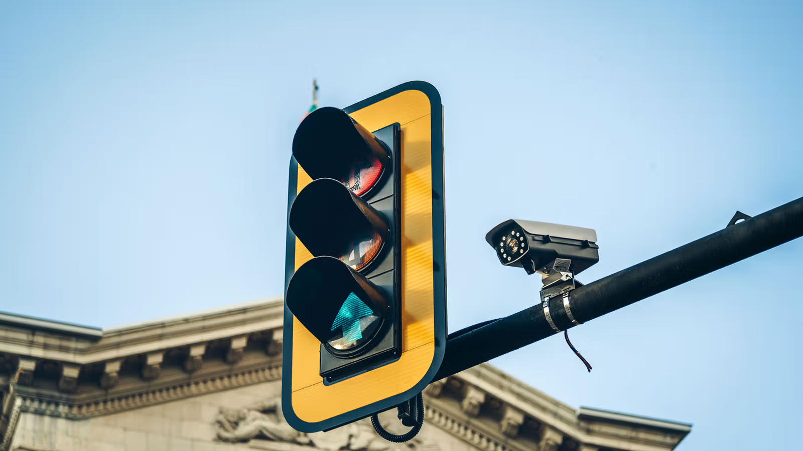

# 🚦 Traffic Light Management & Red Light Violation Detection

🎓 Graduation Project — Computer Engineering
This project focuses on developing a smart traffic light system that efficiently manages traffic flow and detects red light violations using computer vision and machine learning. Built in Jupyter Notebook, the project combines real-time data analysis with model development to provide intelligent, automated traffic regulation.

🔍 Goal: Improve road safety and reduce traffic congestion through AI-powered traffic management.

🧰 Technologies & Tools Used
🔧 Tool / Library	📌 Purpose
💻 Jupyter Notebook	Development environment for code, visualization, and documentation
🐍 Python	Main programming language
📊 NumPy, Pandas	Data manipulation and preprocessing
📉 Matplotlib, Seaborn	Visualization of traffic patterns and model performance
📦 OpenCV	Red light violation detection via video frame analysis
🤖 scikit-learn, TensorFlow, YOLO (or other model)	Traffic object detection and classification
☁️ Kaggle	Cloud environment for running notebooks, accessing datasets, and leveraging GPU/TPU resources.

📂 Traffic-Light-Violation-Detection/
│
├── 📜 LICENSE
├── 📘 README.md
├── 📁 preprocessing_Yolo_input/ contains a PyCharm Program to annotate and preprocess the video to get the RIO's and the csv's required for the Kaggle/colab notebook
└── 📁 Traffic-Management-and-Red-Light-Violation/ the notebooks directory that contains the TrafficManagement logic and the redligth violation logic

🧪 Workflow Overview
🔹 1. Data Collection & Preprocessing
Import real-world traffic video datasets (via Kaggle or local sources)

Frame extraction, annotation, and labeling of vehicles

🔹 2. Exploratory Data Analysis (EDA)
Analyze traffic density, signal durations, violation frequency

Visualize patterns in different intersections/times

🔹 3. Model Development
Train object detection model (e.g., YOLOv5) for detecting:

Vehicles

Traffic lights

Violations (crossing during red light)

🔹 4. Violation Detection
Use bounding boxes and line intersection logic to flag violations

Track vehicles using frame-by-frame analysis

🔹 5. Results & Discussion
Evaluate model accuracy, F1-score, detection precision

Discuss performance in day/night, light/heavy traffic

⚖️ License
This project is open-source under the MIT License — you're free to use, modify, and distribute the work with attribution.

👨‍💻 Contributors
>NafeAbuBaker
>Abed Elrahman Abed
